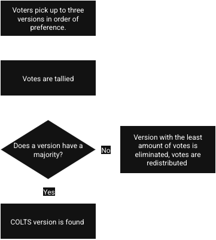


Too long? Consider taking a look at the [short version](https://youtube.com/shorts/zPUz4kC_BuA).

 


**If you support this proposal, sign [here](https://forms.gle/fxZJ9EhCopfLh8nU6)!** There are sections for mod developers, pack developers and players, as this would benefit the scene as a whole, so let your voice be heard! *With enough mod developer support, it might be possible to have the votes be held through curseforge/modrinth itself which would greatly streamline the process.*

The mod developer survey [is still up](https://forms.gle/7V18UmafyWrEkxNZA), if you wish to contribute.


As per the results of a survey, most content mod developers would prefer having more time to develop their mods over constantly porting their mods to the latest version. The mod developer community currently suffers from a lack of clear communication on where modders are gathered, fragmenting the modded minecraft community and leading to burnout from [the treadmill](https://notes.highlysuspect.agency/blog/the_treadmill/) of having to constantly keep up with Mojang. 

## Proposal
A recurring mod developer community vote is hosted to determine a specific Minecraft version as the **COLTS** (Community LTS) version. This would be useful for neoforge mod developers that develop feature rich (thus time consuming to port and maintain) mods, while still allowing the mod developer community to be able to adapt to technical improvements if the majority of developers believe that the technical improvements are worth the time investment.

## Details

|  |
|:--:|
| *The process.* |

A recurring developer vote is hosted to determine if the Stable Modding Version should be updated and, if so, to which version. Longterm Mod development is then focused on said version, allowing the version to mature. Users would need to be verified before being able to vote, to ensure that the COLTs vote remains developer focused.

## Benefits 
### For Mod Developers
- Mod developers can focus on improving their mods or work on new mods (or just live life!) instead of having to constantly port their mods to newer versions.
- Allowing a version to mature also allows for the creation of other helpful tools for modding.
- A recurring vote allows for being able to both have version longevity and be able to react to substantial technical improvements in a reasonable time.
- Mod Developers that choose to port beyond will know what version the modded community at large considers to be stable, and can target feature backports to without needing to guess. (A good point made by P3pp3rf1y, the Sophisticated Storage developer) 
- A more stable scene could encourge new users to join the scene.
- The process is community-driven and provides a unified direction, allowing mod developers to be able work together and communicate with one another, rather than having to guess how other developers might act.

### For Players and Pack Developers
- A stable modding version means more mods will be available on a single version, rather than being scattered across multiple versions.
- Allowing a version to mature fosters the creation of modpacks, which in turn drives the development of more mods and encourages new mod developers to join the community.
- Mod developers being able to focus on improving their mods rather than having to constantly port them results in more feature-rich mods.
- A stable modding version allows for high-quality modpacks to develop.
- Feature backport mods allow players to be able to play with both newer vanilla content and their mods if they wish.
- Vanilla players are not affected by this, as optimization mods, client-side mods, server-side mods, etc would not be affected by this.

## Questions and Answers
### General Questions
**Q**: What about players wanting vanilla content that is not available on the COLTS? \
**A**: Players can be directed to install the [Vanilla Backports](https://www.curseforge.com/minecraft/mc-mods/vanillabackport) mod, or an equivalent.

**Q**: What about some players asking about mod ports? \
**A**: This is primarily caused by players simply not being aware of the time and energy investment required, and would likely be understanding once they learn of that (along with the aforementioned backport mods). If voting is to be handled by curseforge, they could directly address this in a variety of ways if they wished, from informational videos to notices on the comment box.

**Q**: What would the first COLTS be? \
**A**: A developer vote would be held like normal, but if you want a prediction, in a previous survey I conducted, a majority of mod developers indicated they would prefer developing on Neoforge 1.21.1 if they could choose the COLTS themselves.

**Q**: What if mod developers repeatedly elect to stay on a single version forever? \
**A**: This is extremely unlikely, as mod developers do appreciate the technical improvements implemented into the game over time. The issue is that no single patch (or even update in some cases) typically justifies the time and effort required to port. 

**Q**: Why can't mod developers just figure it out themselves like they always have? Why would a developer community vote be needed? \
**A**: This proposal simply addresses the communication issue, allowing the mod developer community to easily vote and communicate with each other. This helps saves lots time and energy by ensuring that mod developers will know what versions to update to and maintain their mods on, rather than having to guess what versions will become populated.

### Regarding Mod Developers on Other Verisons
**Q**: I'm a mod developer who prefers to keep my mods on the latest patch of Minecraft for vanilla players. How will this affect me? \
**A**: It won't affect you at all. It is fully expected that some mods, such as optimization mods, client-side mods, and server-side mods, will continue to target the latest patches. This proposal is aimed at giving mod developers a unified direction for porting and maintaining their mods.

**Q**: I'm a mod developer who prefers to port more frequently. How would this affect me? \
**A**: Like with the vanilla targeted developers, it won't negatively affect your ability to mod. Rather, this will benefit you as well, as you will know what version the modded community at large considers to be stable, and thus will know which version to target feature backports to. This proposal is aimed at giving large mod developers a unified direction for porting *and maintaining* their mods.

### Regarding Voting
**Q**: How would voting work? \
**A**: The vote would be hosted on Curseforge, Discord or another platform, with a verification process in place to ensure that casted COLTS votes are authentic. Discussion channels would also be opened to allow developers to further discuss their thoughts. If you have a platform in specific that you think would work best, feel free to mention it in your vote.

**Q**: How often would these votes occur? \
**A**: Once every year seems ideal. This frequency strikes a balance between providing flexibility to account for new updates bringing technical improvements and version longevity.

**Q**: How would verification work? \
**A**: In the case that these votes were to be handled by Curseforge or Modrinth, this could be fairly streamlined, as they would have access to more data and could handle this automatically. In the event these votes are done by a third party, the best option would likely be to keep it simple and check mod downloads on Curseforge/Modrinth. Admittedly, the hard part would be finding a balance between ensuring accounts are legitimate and not unintentionally disenfranchising chunks of the mod developer community.

### Miscellaneous Questions
**Q**: How would the mod developers be made aware of this proposal? \
**A**: Initally, word of mouth will be the best option. Curseforge staff have stated that they would consider supporting and promoting the project if they think is it viable. Beyond that, other large organizations could help spread the word.
To quote a conversion that I had with Ryan Robson, CurseForge's Creator Relations Manager:
 > I can share any potential community-led projects you are working on with our team and we can support if it's something we think is viable 🙂

So, spread the word, and show your support [on the form](https://forms.gle/fxZJ9EhCopfLh8nU6)!

  
Followup Curseforge related question some might have:

**Q**: Doesn't curseforge have a monetary incentive to keep mod developers on the latest version? \
**A**: Curseforge does not have an incentive to push mod developers to the latest version on the game. To quote Ryan again:
> We have no monetary incentive to push the latest version, and a big part of our platform is continuing to support some older versions and the modpacks they support. Part of the reason we may sometimes (i.e. in contests) push for higher versions is because the modding support is improved (such as better datapack support) on these versions, but overall we have no preference on which versions users create or play content on.

## Supporting
If you agree with this proposal, sign [here](https://forms.gle/fxZJ9EhCopfLh8nU6) and share this proposal with others. While mod developer signatures are the most important, it's also important to demonstrate that everyone in the community would agree that this would be beneficial to the modded community. With enough support, it might be possible to have the votes be held through curseforge itself, greatly streamlining the voting process. If you would prefer to have it be hosted by a third party instead, mention it in your vote.

Some of the mods whose owners support this proposal include:
    
    
    
    
    
         
    
    
    
    
    
    
    
    
    
     
    
    
    
    
    
          
    
    
    
    
    
     

...along with many others!