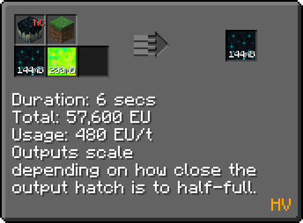
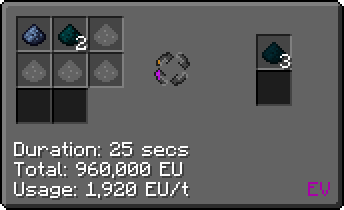

With Gregtech Modern's 7.0 update [now entering prerelease testing](https://discord.com/channels/701354865217110096/1089299439098810549/1391447027077877801), we draw closer to being able to start doing prerelease builds for 0.13! With that means we can finally start doing playtests and gathering feedback!

This week I want to talk about a previously teased multiblock, the sculk vat! The sculk vat sees use in growing sculk, the revamped bioalloy line, as well as seeing use as an option for growing bacteria.

Sculk itself is a bit like bacteria, and follows a growth curve, growing much quicker when there is an existing population, but dropping off when too much is present. This means that if you can keep the output hatch somewhat filled, you can get a far greater return on your inputs! This is pretty useful as Sculk now sees use in creating sculk catalysts and cryolobus.

|  |  |
|:--:|:--:|
| *An unfair trade, right?* | *Now featuring bluesteel!* |

Like other changes that you've seen as of late, this aims to diversify the endgame first and foremost, but also to have the mechanic have more of a presence throughout the pack as whole.

And since you're reading this here, you’re already aware of this little website experiment. I'm not sure if it will stick, but it's always good to keep experimenting.